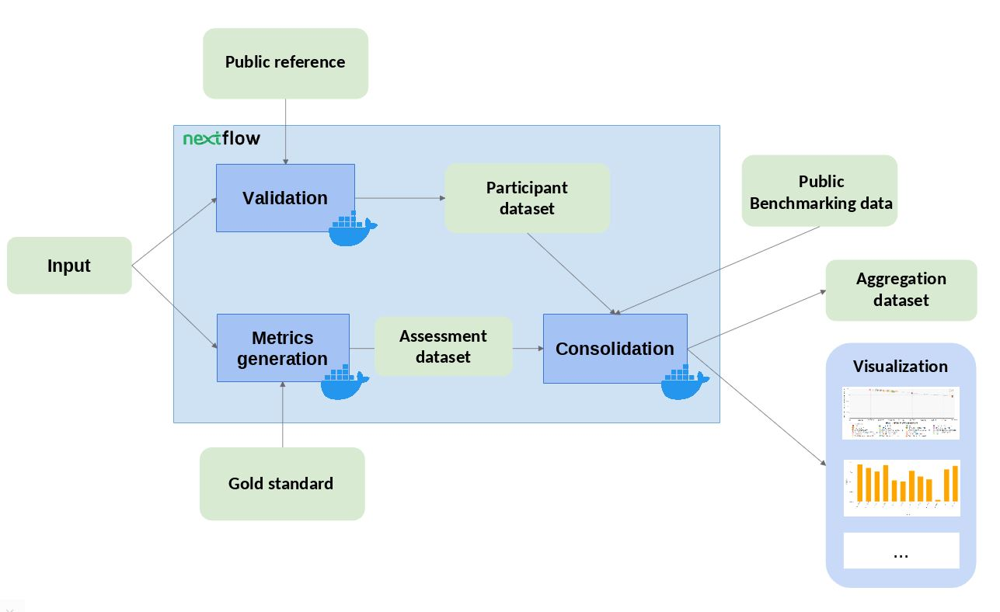

# OpenEBench assessment workflow with Nextflow

Example pipeline with Nextflow used to assess results, comparing the metrics being computed with this workflow with TCGA results.

Nextflow workflows following the same structure as this repo's example will be integratable into the OpenEBench [Virtual Research Environment (VRE)](https://openebench.bsc.es/submission/workspace/).

## Description

The workflow takes an input file with Cancer Driver Genes predictions (i.e. the results provided by a participant), computes a set of metrics, and compares them against the data currently stored in OpenEBench within the TCGA community. Two assessment metrics are provided for that predictions. Also, some plots (which are optional) that allow to visualize the performance of the tool are generated. The workflow consists in three standard steps, defined by OpenEBench. The tools needed to run these steps are containerised in three Docker images, whose recipes are available in the [TCGA_benchmarking_dockers](https://github.com/inab/TCGA_benchmarking_dockers ) repository and the images are stored in the [INB GitLab container registry](https://gitlab.bsc.es/inb/elixir/openebench/workflows/tcga_benchmarking_dockers/container_registry) . Separated instances are spawned from these images for each step:
1. **Validation**: the input file format is checked and, if required, the content of the file is validated (e.g check whether the submitted gene IDs exist)
2. **Metrics Generation**: the predictions are compared with the 'Gold Standards' provided by the community, which results in two performance metrics - precision (Positive Predictive Value) and recall(True Positive Rate).
3. **Consolidation**: the benchmark itself is performed by merging the tool metrics with the rest of TCGA data. The results are provided in JSON format and SVG format (scatter plot).




## Data

* [TCGA_sample_data](./TCGA_sample_data) folder contains all the reference data required by the steps. It is derived from the manuscript:
[Comprehensive Characterization of Cancer Driver Genes and Mutations](https://www.cell.com/cell/fulltext/S0092-8674%2818%2930237-X?code=cell-site), Bailey et al, 2018, Cell [](https://doi.org/10.1016/j.cell.2018.02.060) 
* [TCGA_sample_out](./TCGA_sample_out) folder contains an example output for a worklow run, with two cancer types / challenges selected (ACC, BRCA). Results obtained from the default execution should be similar to those ones available in this directory. Results found in [TCGA_sample_out/results](./TCGA_sample_out/results) can be visualized in the browser using [`benchmarking_workflows_results_visualizer` javascript library](https://github.com/inab/benchmarking_workflows_results_visualizer).

## Requirements
This workflow depends on three tools that have to be installed before you can run it:
* [Git](https://git-scm.com/downloads): Used to download the workflow from GitHub.
* [Docker](https://docs.docker.com/get-docker/): The Docker Engine is used under the hood to execute the containerised steps of the benchmarking workflow.
* [Nextflow](https://www.nextflow.io/): Is the technology used to write and execute the benchmarking workflow. Note that it depends on Bash (>=3.2) and Java (>=8 , <=17). We provide the script [run_local_nextflow.bash](run_local_nextflow.bash) that automates their installation for local testing.

Check that these tools are available in your environment:
```
# Git
> which git
/usr/bin/git
> git --version
git version 2.26.2

# Docker
> which docker
/usr/bin/docker
> docker --version
Docker version 20.10.9-ce, build 79ea9d308018

# Nextflow
> which nextflow
/home/myuser/bin/nextflow
> nextflow -version

      N E X T F L O W
      version 21.04.1 build 5556
      created 14-05-2021 15:20 UTC (17:20 CEST)
      cite doi:10.1038/nbt.3820
      http://nextflow.io
```
In the case of docker, apart from being installed the daemon has to be running. On Linux distributions that use `Systemd` for service management, which includes the most popular ones as of 2021 (Ubuntu, Debian, CentOs, Red Hat, OpenSuse), the `systemctl` command can be used to check its status and manage it:

```
# Check status of docker daemon
> sudo systemctl status docker
● docker.service - Docker Application Container Engine
   Loaded: loaded (/usr/lib/systemd/system/docker.service; disabled; vendor preset: disabled)
   Active: inactive (dead)
     Docs: http://docs.docker.com

# Start docker daemon
> sudo systemctl start docker
```

### Download workflow
Simply clone the repository and check out the latest tag (currently `1.0.8`):

```
# Clone repository
> git clone https://github.com/inab/TCGA_benchmarking_dockers.git

# Move to new directory
cd TCGA_benchmarking_workflow/

# Checkout version 1.0.8
> git checkout 1.0.8 -b 1.0.8
```

## Usage
The workflow can be run workflow in two different ways:
* Standard: `nextflow run main.nf -profile docker`
* Using the bash script that installs Java and Nextflow:`./run_local_nextflow.bash run main.nf -profile docker`.

Arguments specifications:
```
	    Usage:
	    Run the pipeline with default parameters:
	    nextflow run main.nf -profile docker

	    Run with user parameters:
 	    nextflow run main.nf -profile docker --predictionsFile {driver.genes.file} --public_ref_dir {validation.reference.file} --participant_name {tool.name} --metrics_ref_dir {gold.standards.dir} --cancer_types {analyzed.cancer.types} --assess_dir {benchmark.data.dir} --results_dir {output.dir}

	    Mandatory arguments:
                --input                 List of cancer genes prediction
                --community_id          Name or OEB permanent ID for the benchmarking community
                --public_ref_dir        Directory with list of cancer genes used to validate the predictions
                --participant_id        Name of the tool used for prediction
                --goldstandard_dir      Dir that contains metrics reference datasets for all cancer types
                --challenges_ids        List of types of cancer selected by the user, separated by spaces
                --assess_dir            Dir where the data for the benchmark are stored

	    Other options:
                --validation_result     The output directory where the results from validation step will be saved
                --augmented_assess_dir  Dir where the augmented data for the benchmark are stored
                --assessment_results    The output directory where the results from the computed metrics step will be saved
                --outdir                The output directory where the consolidation of the benchmark will be saved
                --statsdir              The output directory with nextflow statistics
                --data_model_export_dir The output dir where json file with benchmarking data model contents will be saved
                --otherdir              The output directory where custom results will be saved (no directory inside)
	    Flags:
                --help                  Display this message
```

Default input parameters and Docker images to use for each step can be specified in the [config](./nextflow.config) file.

**NOTE: In order to make your workflow compatible with the [OpenEBench VRE Nextflow Executor](https://github.com/inab/vre-process_nextflow-executor), please make sure to use the same parameter names in your workflow.**
