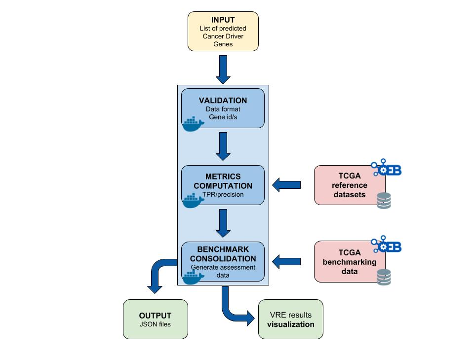

# OpenEBench assessment workflow with Nextflow

Example pipeline with Nextflow used to assess results, comparing the metrics being computed with this workflow with TCGA results.

Nextflow workflows following the same structure as this repo's example will be integratable into the OpenEBench [Virtual Research Environment (VRE)](https://openebench.bsc.es/submission/workspace/).

## Description

The workflow takes an input file with Cancer Driver Genes predictions (i.e. the results provided by a participant), computes a set of metrics, and compares them against the data currently stored in OpenEBench within the TCGA community. Two assessment metrics are provided for that predicitions. Also, some plots (which are optional) that allow to visualize the performance of the tool are generated. The workflow consists in three standard steps, defined by OpenEBench. The tools needed to run these steps must be in one or more Docker images, generated from [Docker containers](https://github.com/inab/TCGA_benchmarking_dockers ). Separated instances are spawned from these images for each step:
1. **Validation**: the input file format is checked and, if required, the content of the file is validated (e.g check whether the submitted gene IDs exist)
2. **Metrics Computation**: the predictions are compared with the 'Gold Standards' provided by the community, which results in two performance metrics - precision (Positive Predictive Value) and recall(True Positive Rate).
3. **Results Consolidation**: the benchmark itself is performed by merging the tool metrics with the rest of TCGA data. The results are provided in JSON format and SVG format (scatter plot).




## Data

* [TCGA_sample_data](./TCGA_sample_data) folder contains all the reference data required by the steps. It is derived from the manuscript:
[Comprehensive Characterization of Cancer Driver Genes and Mutations](https://www.cell.com/cell/fulltext/S0092-8674%2818%2930237-X?code=cell-site), Bailey et al, 2018, Cell [](https://doi.org/10.1016/j.cell.2018.02.060) 
* [TCGA_sample_out](./TCGA_sample_out) folder contains an example output for a worklow run, with two cancer types / challenges selected (ACC, BRCA). Results obtained from the default execution should be similar to those ones available in this directory. Results found in [TCGA_sample_out/results](./TCGA_sample_out/results) can be visualized in the browser using [`benchmarking_workflows_results_visualizer` javascript library](https://github.com/inab/benchmarking_workflows_results_visualizer).


## Usage
In order to use the workflow you need to:
* Install [Nextflow](https://www.nextflow.io/), which depends on Java virtual machine (>=8 , <15 ). You can automate their installation for local testing using [run_local_nextflow.bash](run_local_nextflow.bash).
* Clone [TCGA benchmarking Docker definitions repository](https://github.com/inab/TCGA_benchmarking_dockers) from tag 1.0.2 in a separate directory, and build locally the three Docker images found in it, running the `build.sh 1.0.2` script within that repo.
* Run it just using either *`nextflow run main.nf -profile docker`* or *`./run_local_nextflow.bash run main.nf -profile docker`*. Arguments specifications:
```
	    Usage:
	    Run the pipeline with default parameters:
	    nextflow run main.nf -profile docker

	    Run with user parameters:
 	    nextflow run main.nf -profile docker --predictionsFile {driver.genes.file} --public_ref_dir {validation.reference.file} --participant_name {tool.name} --metrics_ref_dir {gold.standards.dir} --cancer_types {analyzed.cancer.types} --assess_dir {benchmark.data.dir} --results_dir {output.dir}

	    Mandatory arguments:
                --input		List of cancer genes prediction
				--community_id			Name or OEB permanent ID for the benchmarking community
                --public_ref_dir 		Directory with list of cancer genes used to validate the predictions
                --participant_id  		Name of the tool used for prediction
                --goldstandard_dir 		Dir that contains metrics reference datasets for all cancer types
                --event_id  		List of types of cancer selected by the user, separated by spaces
                --assess_dir			Dir where the data for the benchmark are stored

	    Other options:
                --validation_result		The output file where the results from validation step will be saved
				--assessment_results	The output file where the results from the computed metrics step will be saved
				--aggregation_results	The output file where the consolidation of the benchmark will be saved
				--statistics_results	The output directory with nextflow statistics
				--outdir	The output directory where the consolidation of the benchmark will be saved
				--statsdir	The output directory with nextflow statistics
				--data_model_export_dir	The output dir where json file with benchmarking data model contents will be saved
	  			--otherdir					The output directory where custom results will be saved (no directory inside)
	    Flags:
                --help			Display this message
```

Default input parameters and Docker images to use for each step can be specified in the [config](./nextflow.config) file
**NOTE: In order to make your workflow compatible with the [OpenEBench VRE Nextflow Executor](https://github.com/inab/vre-process_nextflow-executor), please make sure to use the same parameter names in your workflow.**
